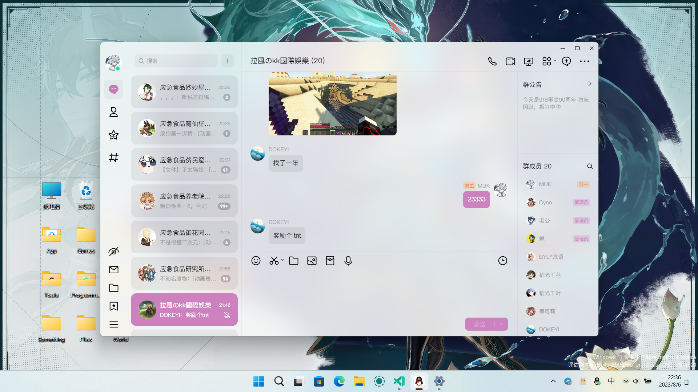
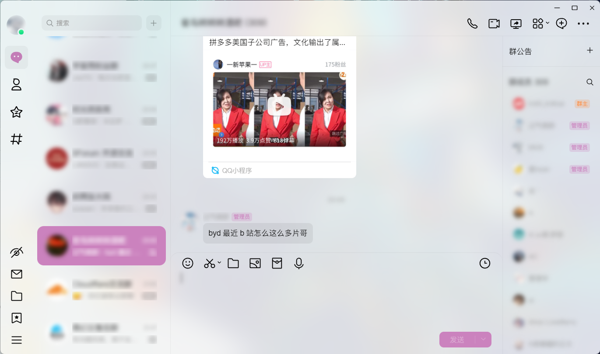
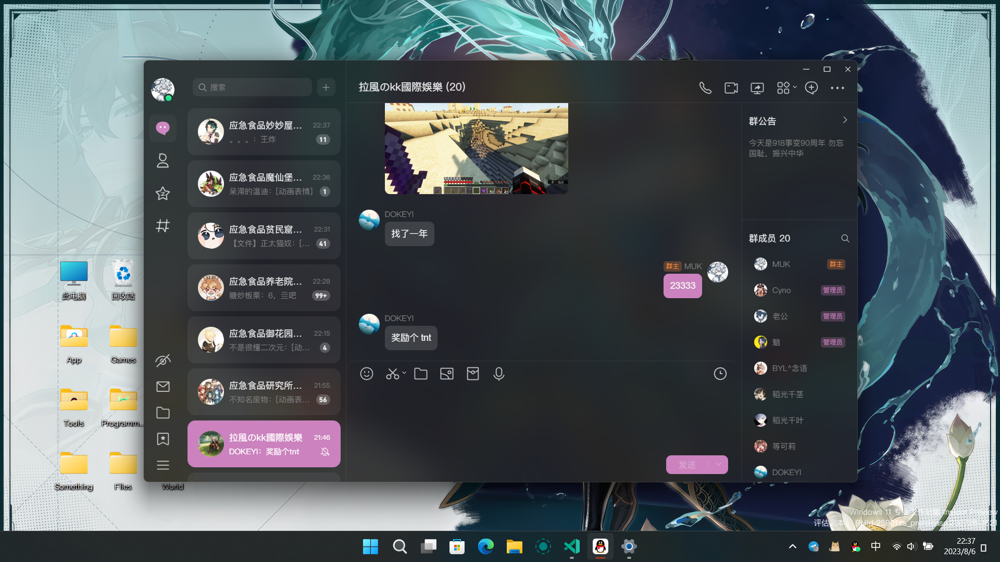
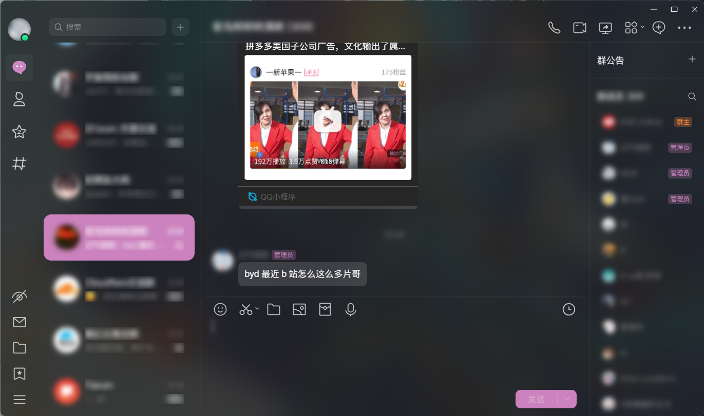
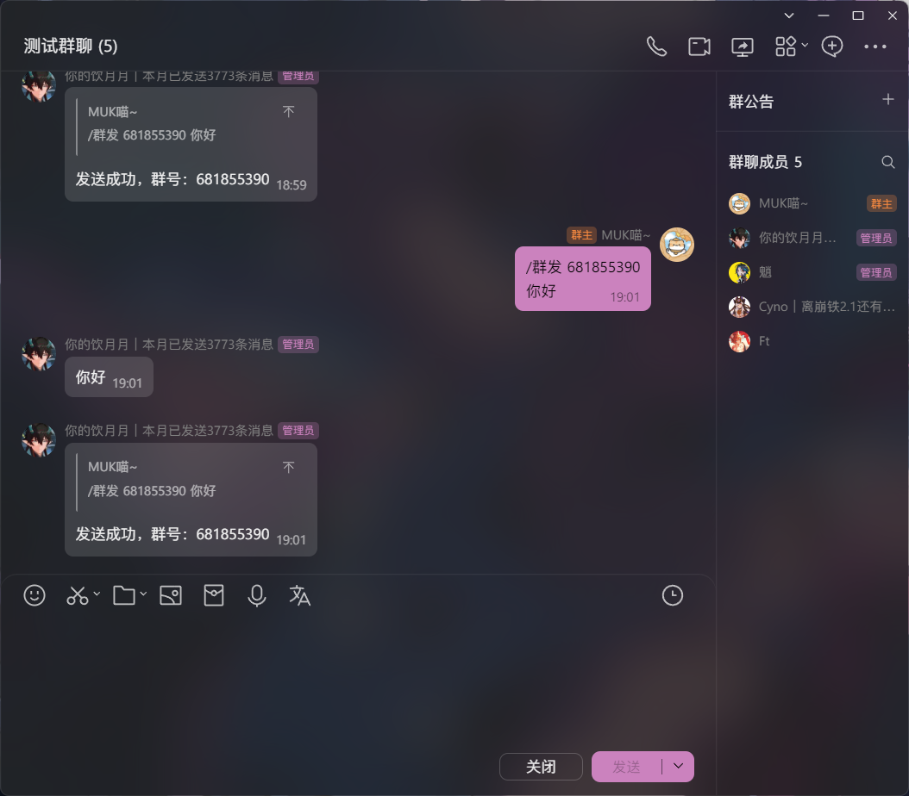

# LiteLoaderQQNT-MSpring-Theme

> [!NOTE]
> 该分支最低支持 LiteLoaderQQNT 1.0.0（测试版），v3 分支支持 1.0.0 以下版本

[LiteLoaderQQNT](https://github.com/mo-jinran/LiteLoaderQQNT) 主题，优雅 · 粉粉 · 细致

目前适配了大部分日间模式以及夜间模式场景，对很多地方的细节都进行了处理，欢迎使用 & star

## 目录

- [注意事项](#注意事项)
- [截图](#截图)
  - [日间模式](#日间模式)
  - [夜间模式](#夜间模式)
  - [设置页面](#设置页面)
  - [优化消息排版演示](#优化消息排版演示)
- [使用方法](#使用方法)
    <!-- * [插件市场（推荐）](#插件市场推荐) -->
  - [手动安装](#手动安装)
- [插件冲突分析](#插件冲突分析)
- [其他](#其他)

## 注意事项

> [!TIP]
> Windows11 请在 `设置 - 通用 - 其他` 中开启 **透明效果**。\
> Linux (KDE) 请配合 [Linux | 背景毛玻璃](https://github.com/mo-jinran/linux-qqnt-background-blur) 插件使用。\
> Linux 更改主题颜色后需要重启 QQ 才能生效

> [!CAUTION]
> **不要在 QQ 官方群聊发送*任何*可以看出你使用了第三方插件的截图，不论是本主题还是其他主题其他插件**

作者之前没怎么接触过前端开发，所以非常菜鸡（）\
如果你发现哪里还没有适配或者哪里有问题，欢迎提 Issues

<!-- 基于 LiteLoaderQQNT 作者的 [test-theme](https://github.com/mo-jinran/test-theme) 编写 -->

## 截图

### 日间模式

### 夜间模式

### 设置页面

### 优化消息排版演示

## 使用方法

<!-- ### 插件市场（推荐）

在 LiteLoader 插件市场内找到 `MSpring Theme`，点击安装按钮，等待安装按钮变为重启按钮，点击重启按钮重启 QQ 即可 -->

### 手动安装

将下载的 Zip 文件解压，解压出的文件夹移动至 `LiteLoaderQQNT/plugins/` 内，重启 QQ 即可

## 插件冲突分析

- **优化消息排版** 功能在 [**Markdown 插件**](https://github.com/d0j1a1701/LiteLoaderQQNT-Markdown) 开启时会失效，Markdown 插件自带了 `pangu.js` 的中英混排优化，开启二者之一就可以了
- 最新版优化了开启 **背景插件** 和 **轻量工具箱-自定义背景** 之后的样式，开启 **轻量工具箱-自定义背景** 之后需要重启一次 QQ

## 其他

<picture>
  <source
    media="(prefers-color-scheme: dark)"
    srcset="
      https://api.star-history.com/svg?repos=MUKAPP/LiteLoaderQQNT-MSpring-Theme&type=Date&theme=dark
    "
  />
  <source
    media="(prefers-color-scheme: light)"
    srcset="
      https://api.star-history.com/svg?repos=MUKAPP/LiteLoaderQQNT-MSpring-Theme&type=Date
    "
  />
  
</picture>
