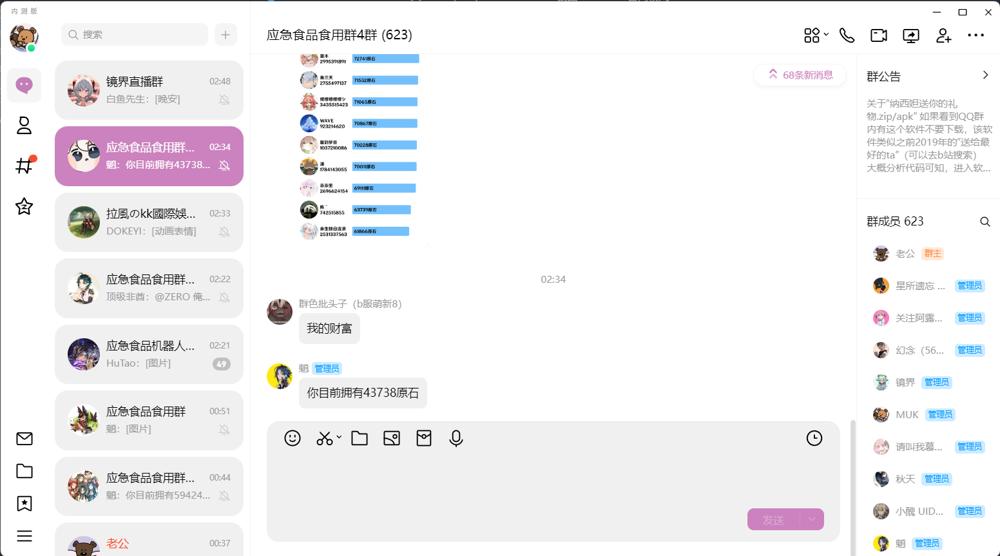
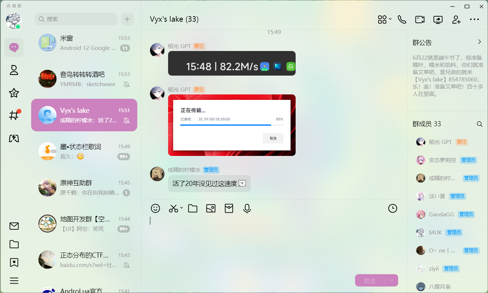
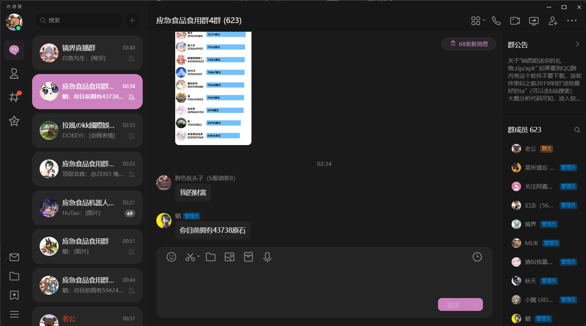
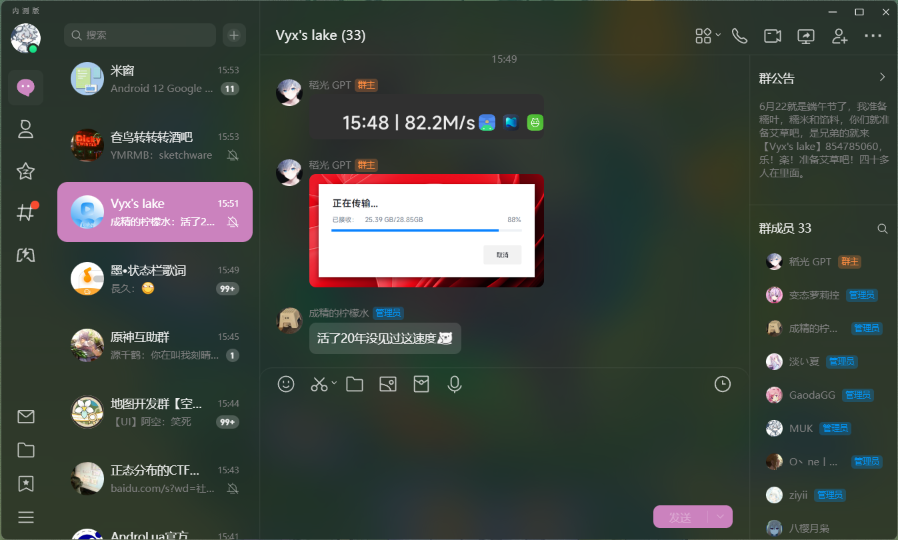
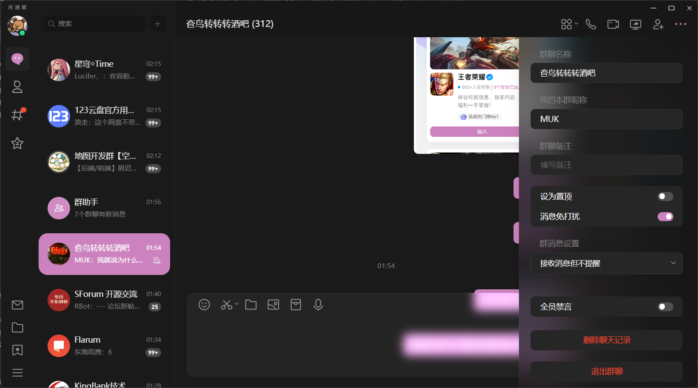

# LiteLoaderQQNT-MSpring-Theme

[LiteLoaderQQNT](https://github.com/mo-jinran/LiteLoaderQQNT) 主题，优雅 · 粉粉 · 细致

目前适配了大部分日间模式以及夜间模式场景，对很多地方的细节都进行了处理，欢迎使用

> Windows11 请使用 最新版QQ（14480及以上版本）并在 `设置 - 通用 - 其他` 中开启 **透明效果**。\
> Linux(KDE) 请配合 [Linux - 背景毛玻璃](https://github.com/mo-jinran/linux-qqnt-background-blur) 插件使用。\
> Linux 更改主题颜色后需要重启QQ才能生效（我也不知道为什么）
> 
> 非Windows版 暂时无法更改背景颜色透明度（chromium版本过低）

事实上我不怎么会 css，模仿着改的（）

如果你发现哪里还没有适配或者哪里有问题，欢迎提 Issues

基于 LiteLoaderQQNT 作者的 [test-theme](https://github.com/mo-jinran/test-theme) 编写

## 截图

### 日间模式

### 夜间模式

## 使用方法

下载的 Zip文件 解压，将解压出的文件夹移动至 `LiteLoaderQQNT数据目录/plugins/` 内，重启 QQ 即可

注：LiteLoaderQQNT 的默认数据目录在 `用户目录/Documents/LiteLoaderQQNT`