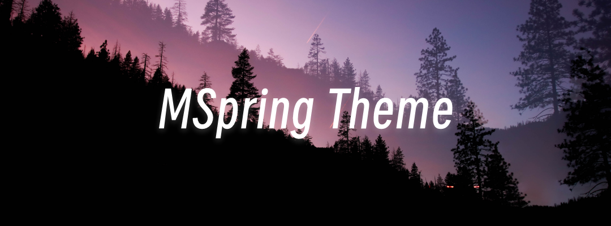
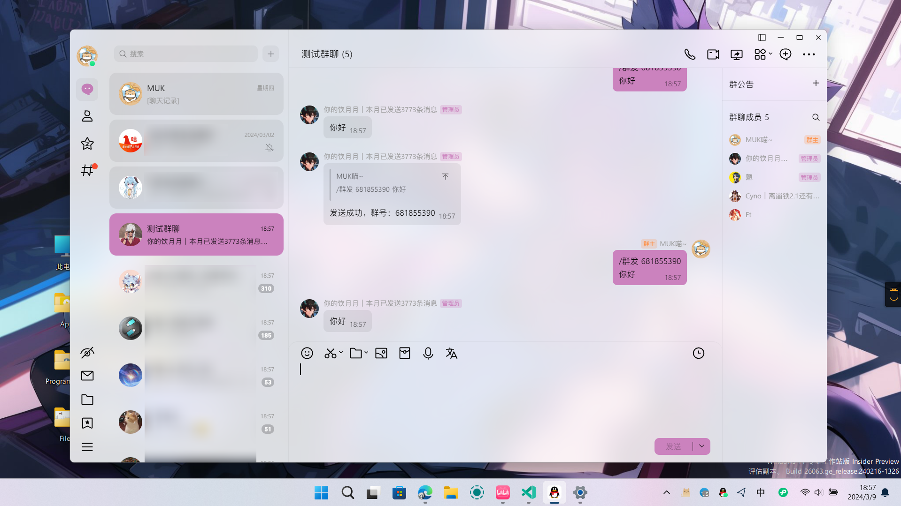
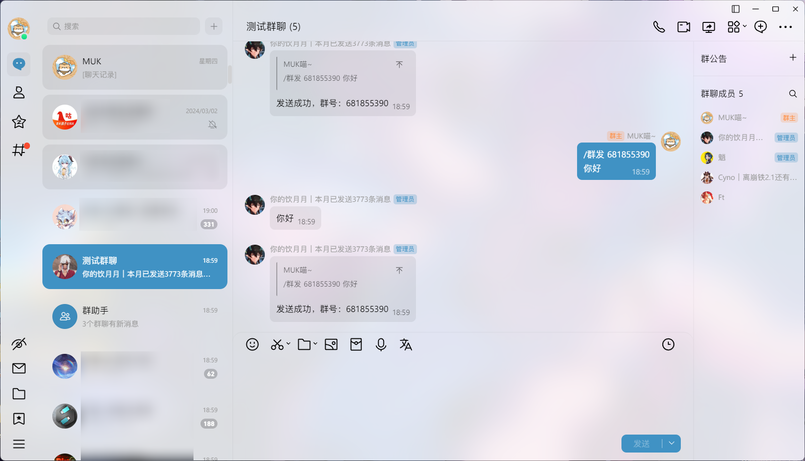
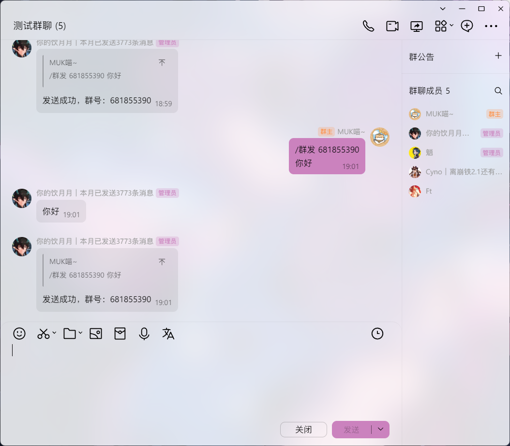
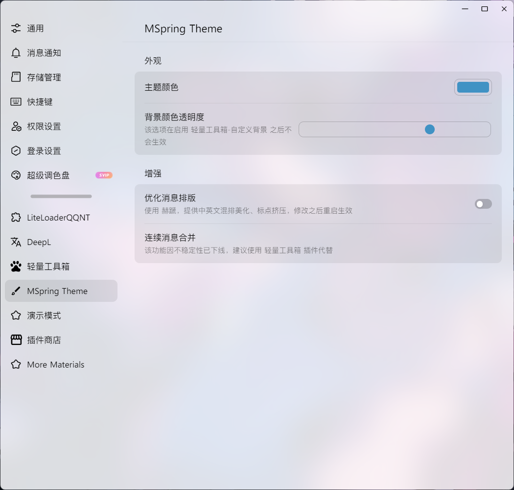
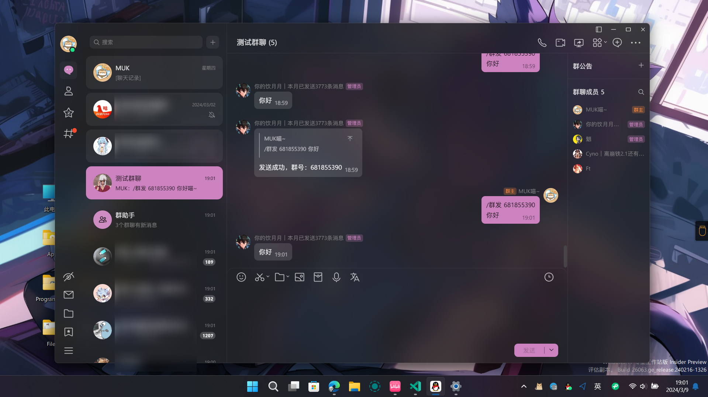
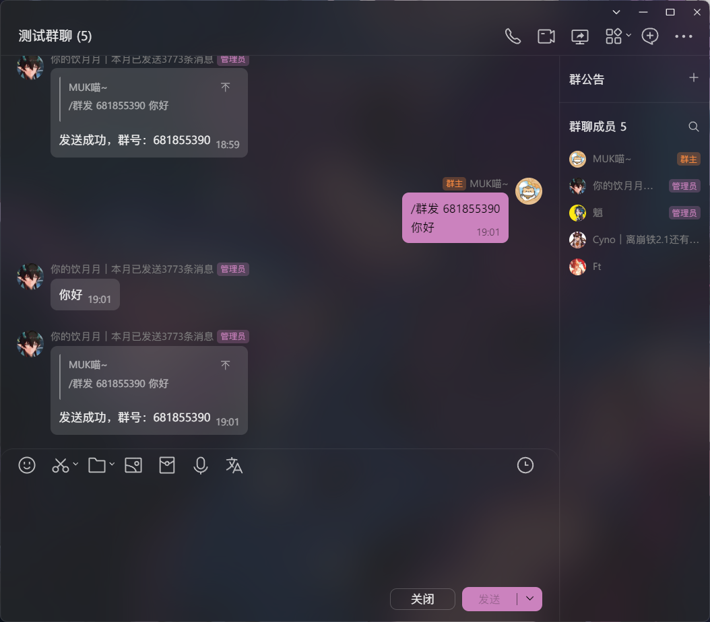
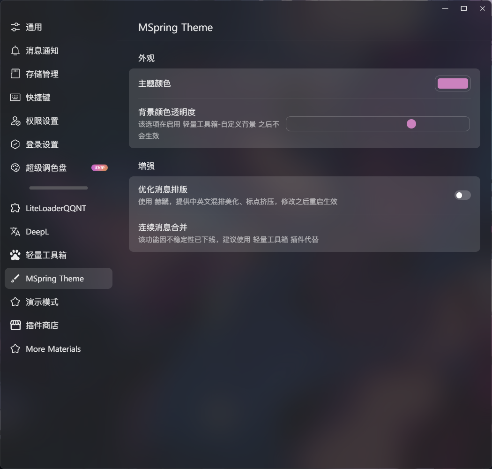
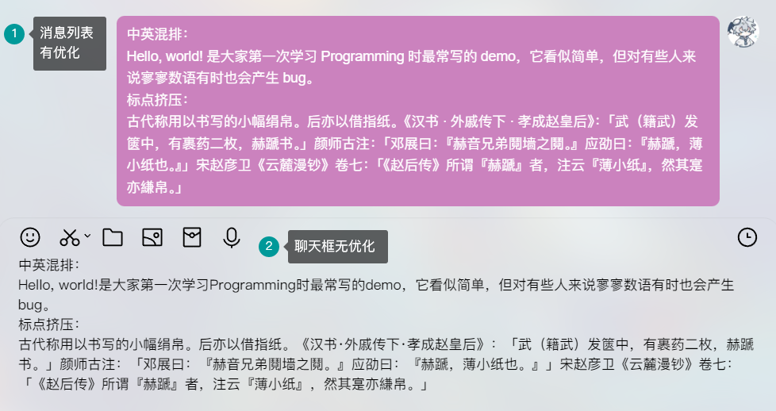

# LiteLoaderQQNT-MSpring-Theme

> [!NOTE]  
> 该分支最低支持 LiteLoaderQQNT 1.0.0（测试版），v3 分支支持 1.0.0 以下版本

[LiteLoaderQQNT](https://github.com/LiteLoaderQQNT/LiteLoaderQQNT)/QwQNT 主题，优雅 · 粉粉 · 细致

目前适配了大部分日间模式以及夜间模式场景，对很多地方的细节都进行了处理，欢迎使用 & star

MUK 的 TG 频道：[MUKAPP](https://t.me/MUKAPP_Personal) 

> [!WARNING]  
> 由于风控严重，本插件开发进度可能会很缓慢

## 目录

- [LiteLoaderQQNT-MSpring-Theme](#liteloaderqqnt-mspring-theme)
  - [目录](#目录)
  - [注意事项](#注意事项)
  - [截图](#截图)
    - [日间模式](#日间模式)
    - [夜间模式](#夜间模式)
    - [优化消息排版演示](#优化消息排版演示)
  - [安装方法](#安装方法)
    - [LiteLoaderQQNT](#liteloaderqqnt)
      - [管理器安装](#管理器安装)
      - [插件列表查看](#插件列表查看)
      - [PluginInstaller](#plugininstaller)
    - [QwQNT](#qwqnt)
  - [插件冲突分析](#插件冲突分析)
  - [其他](#其他)

## 注意事项

> [!TIP]  
> Windows11 22H2 及以上的版本推荐搭配 [More Materials](https://github.com/mo-jinran/More-Materials) 插件使用。\
> Linux (KDE) 请配合 [More Materials](https://github.com/mo-jinran/More-Materials) 插件使用。\
> Linux 更改主题颜色后需要重启 QQ 才能生效\
> 其他平台请自行尝试
>
> 设置界面适配 QQ 的设置（不包括超级调色盘）以及使用了 Web Components 的插件的设置，不会主动适配未使用 Web Components 的插件的设置界面
> 
> 修改背景推荐使用 [背景插件 (Background Plugin)](https://github.com/xh321/LiteLoaderQQNT-Background-Plugin) 或者 [轻量工具箱](https://github.com/xiyuesaves/LiteLoaderQQNT-lite_tools) 的自定义背景功能，开启或关闭自定义背景之后需要重启一次 QQ

> [!CAUTION]  
> **不要在 QQ 官方群聊发送*任何*可以看出你使用了第三方插件的截图，不论是本主题还是其他主题其他插件**

作者之前没怎么接触过前端开发，所以非常菜鸡（）\
如果你发现哪里还没有适配或者哪里有问题，欢迎提 Issues

## 截图

### 日间模式

### 夜间模式

### 优化消息排版演示

## 安装方法

### LiteLoaderQQNT

#### 管理器安装

下载 [release](https://github.com/MUKAPP/LiteLoaderQQNT-MSpring-Theme/releases/latest) 内的 `LiteLoaderQQNT-MSpring-Theme.zip`，进入 LiteLoaderQQNT 设置，找到“安装新插件”右侧的“选择文件”按钮，选择刚刚下载的 zip 文件。

#### 插件列表查看

安装 [插件列表查看](https://github.com/ltxhhz/LL-plugin-list-viewer) 插件，打开对应设置页面，找到本插件，点击 **安装** - **使用 Release 包**，安装完成之后重启

#### PluginInstaller

安装 [PluginInstaller](https://github.com/xinyihl/LiteLoaderQQNT-PluginInstaller) 插件，打开对应设置页面，在安装插件输入框内输入 `https://raw.githubusercontent.com/MUKAPP/LiteLoaderQQNT-MSpring-Theme/v4/manifest.json`，点击确定按钮\
或者也可以同时安装 [Protocio](https://github.com/PRO-2684/protocio) 插件，然后点击 [该链接](https://mukapp.github.io/LiteLoaderQQNT-MSpring-Theme/res/github/protocio-install.html) 直接拉起 PluginInstaller 安装插件

### QwQNT

下载 [release](https://github.com/MUKAPP/LiteLoaderQQNT-MSpring-Theme/releases/latest) 内的 `LiteLoaderQQNT-MSpring-Theme.zip`，将下载的 zip 文件解压，解压出的文件夹移动至 `qwqnt/qwqnt-storage/plugins/` 内，重启 QQ 即可\
（如果解压之后不是一个文件夹，而是几个文件夹和几个文件，那么请创建一个文件夹，将解压出来的文件夹和文件放进去，然后再移动到上述路径内）

## 插件冲突分析

- **优化消息排版** 功能在 [**Markdown 插件**](https://github.com/d0j1a1701/LiteLoaderQQNT-Markdown) 开启时会失效，Markdown 插件自带了 `pangu.js` 的中英混排优化，开启二者之一就可以了

## 其他

<picture>
  <source
    media="(prefers-color-scheme: dark)"
    srcset="
      https://api.star-history.com/svg?repos=MUKAPP/LiteLoaderQQNT-MSpring-Theme&type=Date&theme=dark
    "
  />
  <source
    media="(prefers-color-scheme: light)"
    srcset="
      https://api.star-history.com/svg?repos=MUKAPP/LiteLoaderQQNT-MSpring-Theme&type=Date
    "
  />
  
</picture>
